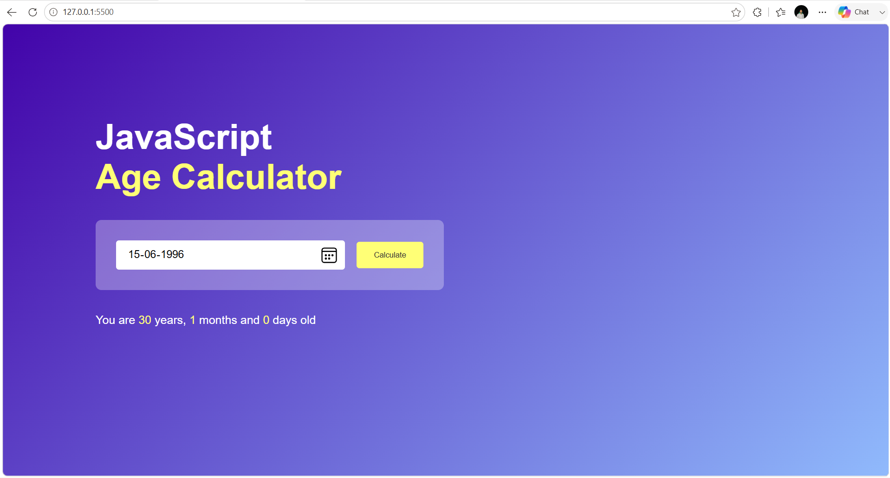

# 🎂 Age Calculator

A simple, elegant, and responsive **Age Calculator** built with **HTML, CSS, and JavaScript**. It calculates your exact age in **years, months, and days** based on your date of birth using JavaScript's Date API.

---

## 🚀 Live Demo

🌐 **Live Website:** 

---

## 📸 Project Preview



---

## ✨ Features

- 🎂 Calculate exact age instantly
- 📅 Easy-to-use date picker
- 📆 Displays years, months, and days
- 🚫 Prevents selecting future dates
- ⚡ Fast and accurate calculations
- 📱 Fully responsive design
- 🎨 Modern gradient UI

---

## 🛠️ Tech Stack

- HTML5
- CSS3
- JavaScript (ES6)

---

## 📂 Project Structure

```
Age-Calculator/
│
├── index.html
├── style.css
├── script.js
├── README.md
└── images/
    └── preview.png
```

---

## 🚀 Getting Started

### Clone the Repository

```bash
git clone https://github.com/ydv-hrx/age-calculator.git
```

### Navigate to the Project

```bash
cd age-calculator
```

### Run the Project

Simply open **index.html** in your browser

or

Use **Live Server** in VS Code.

---

## 📖 How It Works

1. Select your date of birth.
2. Click the **Calculate** button.
3. The application calculates:
   - ✅ Years
   - ✅ Months
   - ✅ Days
4. Your exact age is displayed instantly.

---

## 🎯 Learning Outcomes

This project helped me improve my understanding of:

- JavaScript Date Object
- DOM Manipulation
- Date Calculations
- Event Handling
- Responsive Web Design
- Clean Code Practices

---

## 💡 Future Improvements

- 🎉 Birthday Countdown
- 🎂 Next Birthday Reminder
- 📊 Age in Weeks, Hours & Minutes
- 🌙 Dark Mode
- 🎈 Birthday Celebration Animation
- 📱 Better Mobile UI

---

## 👨‍💻 Author

**Hrithik Roshan**

📧 Email: hrithikroshan1811@gmail.com

🐙 GitHub: https://github.com/ydv-hrx

💼 LinkedIn: https://www.linkedin.com/in/hrithik-roshan-a55772333

---

## ⭐ Show Your Support

If you found this project useful, consider giving it a **⭐ Star** on GitHub.

---

## 📅 30 Days Project Challenge

This project is part of my **#30DaysProjectChallenge**, where I build one project every day to strengthen my web development skills and share my learning journey publicly.

Stay tuned for more exciting projects! 🚀

---

### 📌 Connect With Me

- 💼 LinkedIn: https://www.linkedin.com/in/hrithik-roshan-a55772333
- 🐙 GitHub: https://github.com/ydv-hrx
