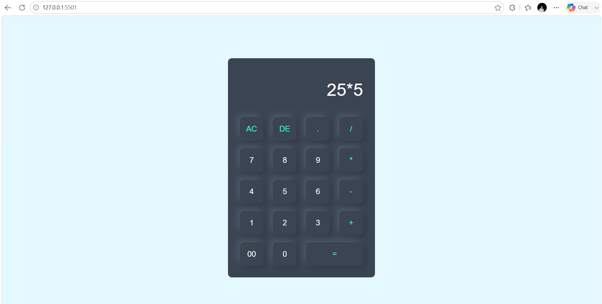

# 🧮 Calculator Web App

A clean and responsive **Calculator Web App** built using **HTML, CSS, and JavaScript**. This project performs basic arithmetic operations with a simple and user-friendly interface, making it a great project for learning JavaScript fundamentals.

---

## 🚀 Live Demo

🌐 **Live Website:** *(Add your Vercel link here)*

---

## 📸 Project Preview



---

## ✨ Features

- ➕ Addition
- ➖ Subtraction
- ✖️ Multiplication
- ➗ Division
- 🔢 Decimal Number Support
- 🗑️ Clear (AC) Button
- ⌫ Delete (DE) Button
- 🟰 Instant Calculation
- 📱 Responsive Design
- 💻 Clean & Minimal UI

---

## 🛠️ Technologies Used

- HTML5
- CSS3
- JavaScript

---

## 📂 Folder Structure

```text
Calculator-Web-App/
│
├── index.html
├── style.css
├── README.md
└── preview.png
```

---

## 🚀 Getting Started

### Clone the Repository

```bash
git clone https://github.com/ydv-hrx/30-Day-30-Projects.git
```

### Navigate to the Project

```bash
cd Calculator-Web-App
```

### Run the Project

Open **index.html**

or

Use **Live Server** in VS Code.

---

## 📖 Project Highlights

- Simple and modern calculator interface
- Performs basic arithmetic calculations
- Responsive design for different screen sizes
- Easy-to-use button layout
- Beginner-friendly JavaScript project

---

## 🎯 Learning Outcomes

While building this project, I learned:

- HTML Forms
- CSS Grid & Layout
- JavaScript DOM Manipulation
- Event Handling
- Arithmetic Operations
- JavaScript `eval()` Function
- Responsive UI Design

---

## 💡 Future Improvements

- 🧮 Scientific Calculator Functions
- ⌨️ Keyboard Input Support
- 📜 Calculation History
- 🌙 Dark & Light Mode
- 🔊 Button Click Sound
- ⚠️ Better Error Handling
- 🧠 Replace `eval()` with a safer calculation logic

---

## 👨‍💻 Author

**Hrithik Roshan**

📧 Email: hrithikroshan1811@gmail.com

🐙 GitHub: https://github.com/ydv-hrx

💼 LinkedIn: https://www.linkedin.com/in/hrithik-roshan-a55772333

---

## ⭐ Show Your Support

If you found this project helpful, please consider giving this repository a **⭐ Star**.

---

## 📅 30 Days Project Challenge

This project is part of my **#30DaysProjectChallenge**, where I'm building one project every day to strengthen my frontend development skills and create a professional portfolio.

Stay tuned for more exciting projects! 🚀

---

## 📬 Connect With Me

💼 **LinkedIn:** https://www.linkedin.com/in/hrithik-roshan-a55772333

🐙 **GitHub:** https://github.com/ydv-hrx