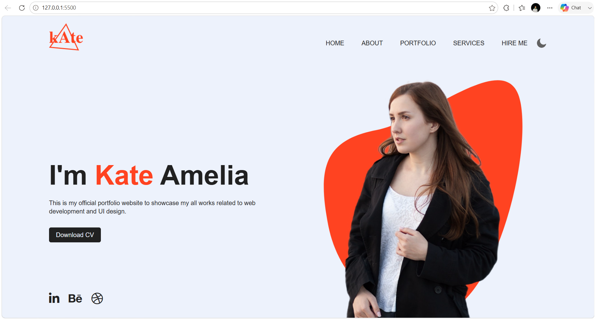

# 🌐 Personal Portfolio Website

A modern and responsive **Personal Portfolio Website** built using **HTML, CSS, and JavaScript**. This project showcases a developer's profile, skills, portfolio, and social links with a beautiful user interface. It also includes a **Dark Mode / Light Mode** toggle using JavaScript and Local Storage.

---

## 🚀 Live Demo

🌐 **Live Website:** https://30-day-30-projects-1ayk.vercel.app/

---

## 📸 Project Preview



---

## ✨ Features

- 👨‍💻 Modern Portfolio Design
- 🌙 Dark & Light Theme Toggle
- 💾 Theme Preference Saved with Local Storage
- 📱 Responsive Layout
- 🎨 Clean and Attractive UI
- 📄 Download CV Button
- 🖼️ Hero Section with Animation
- 🔗 Social Media Links
- ⚡ Fast & Lightweight

---

## 🛠️ Technologies Used

- HTML5
- CSS3
- JavaScript
- Font Awesome

---

## 📂 Folder Structure

```text
Portfolio-Website/
│
├── index.html
├── style.css
├── README.md
│
├── images/
│   ├── logo.png
│   ├── moon.png
│   ├── sun.png
│   ├── pattern.png
│   ├── girl.png
│   └── preview.png
```

---

## 🚀 Getting Started

### Clone the Repository

```bash
git clone https://github.com/ydv-hrx/30-Day-30-Projects.git
```

### Navigate to the Project

```bash
cd Portfolio-Website
```

### Run the Project

Open **index.html**

or

Use **Live Server** in VS Code.

---

## 📖 Project Highlights

- Modern personal portfolio landing page
- Dark Mode and Light Mode support
- Theme preference stored using Local Storage
- Responsive and clean layout
- Download CV section
- Social media integration
- Beginner-friendly project structure

---

## 🎯 Learning Outcomes

While building this project, I learned:

- Semantic HTML
- CSS Positioning & Layout
- Responsive Web Design
- JavaScript DOM Manipulation
- Local Storage
- Theme Switching
- Font Awesome Integration

---

## 💡 Future Improvements

- 📄 About Section
- 💼 Projects Section
- 🛠️ Skills Section
- 📞 Contact Form
- ✉️ Email Integration
- 🎬 Smooth Scroll Animations
- 🌐 Multi-Page Portfolio
- 📊 GitHub Contribution Graph
- 📱 Better Mobile Navigation

---

## 👨‍💻 Author

**Hrithik Roshan**

📧 Email: hrithikroshan1811@gmail.com

🐙 GitHub: https://github.com/ydv-hrx

💼 LinkedIn: https://www.linkedin.com/in/hrithik-roshan-a55772333

---

## ⭐ Show Your Support

If you found this project helpful, please consider giving this repository a **⭐ Star**.

---

## 📅 30 Days Project Challenge

This project is part of my **#30DaysProjectChallenge**, where I'm building one project every day to improve my frontend development skills and create a professional portfolio.

Stay tuned for more exciting projects! 🚀

---

## 📬 Connect With Me

💼 **LinkedIn:** https://www.linkedin.com/in/hrithik-roshan-a55772333

🐙 **GitHub:** https://github.com/ydv-hrx