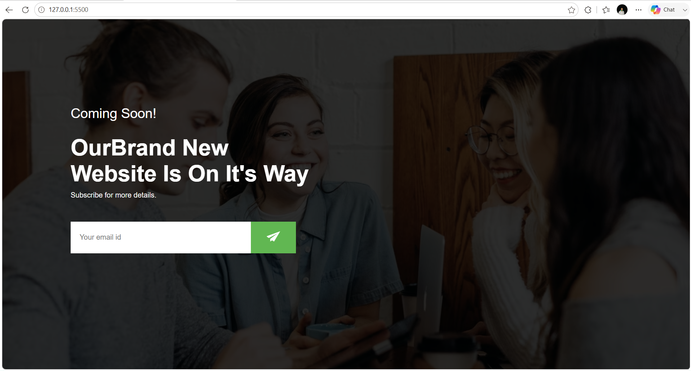

# 📧 Email Subscription Form with Google Sheets

A modern and responsive **Email Subscription Form** built using **HTML, CSS, and JavaScript**. This project allows users to subscribe with their email address, and the submitted data is automatically stored in **Google Sheets** using **Google Apps Script**.

---

## 🚀 Live Demo

🌐 **Live Website:** https://30-day-30-projects-5s74.vercel.app/

---

## 📸 Project Preview



---

## ✨ Features

- 📧 Email Subscription Form
- ☁️ Google Sheets Integration
- ⚡ Real-Time Form Submission
- ✅ Success Confirmation Message
- 📱 Responsive Design
- 💻 Clean & Modern UI
- 🚀 Beginner-Friendly Project

---

## 🛠️ Technologies Used

- HTML5
- CSS3
- JavaScript
- Google Apps Script
- Google Sheets API

---

## 📂 Folder Structure

```text
Email-Subscription-Form/
│
├── index.html
├── style.css
├── send-icon.png
├── README.md
└── preview.png
```

---

## 🚀 Getting Started

### Clone the Repository

```bash
git clone https://github.com/ydv-hrx/30-Day-30-Projects.git
```

### Navigate to the Project

```bash
cd Email-Subscription-Form
```

### Run the Project

Open **index.html**

or

Use **Live Server** in VS Code.

---

## 📖 Project Highlights

- Collects email addresses through a simple subscription form
- Stores submitted data directly into Google Sheets
- Displays a success message after submission
- Lightweight and responsive interface
- Beginner-friendly implementation of Google Apps Script

---

## 🎯 Learning Outcomes

While building this project, I learned:

- HTML Forms
- JavaScript Fetch API
- Form Validation
- Google Apps Script
- Google Sheets Integration
- DOM Manipulation
- Asynchronous JavaScript (Promises)

---

## 💡 Future Improvements

- 📨 Email Confirmation After Subscription
- 🔒 Better Form Validation
- 📊 Admin Dashboard
- 🌙 Dark Mode
- ✨ Loading Spinner During Submission
- 🚫 Duplicate Email Detection
- 📧 Newsletter Integration (Mailchimp/Brevo)

---

## 👨‍💻 Author

**Hrithik Roshan**

📧 Email: hrithikroshan1811@gmail.com

🐙 GitHub: https://github.com/ydv-hrx

💼 LinkedIn: https://www.linkedin.com/in/hrithik-roshan-a55772333

---

## ⭐ Show Your Support

If you found this project helpful, please consider giving this repository a **⭐ Star**.

---

## 📅 30 Days Project Challenge

This project is part of my **#30DaysProjectChallenge**, where I'm building one project every day to improve my frontend development skills and create a strong developer portfolio.

Stay tuned for more exciting projects! 🚀

---

## 📬 Connect With Me

💼 **LinkedIn:** https://www.linkedin.com/in/hrithik-roshan-a55772333

🐙 **GitHub:** https://github.com/ydv-hrx