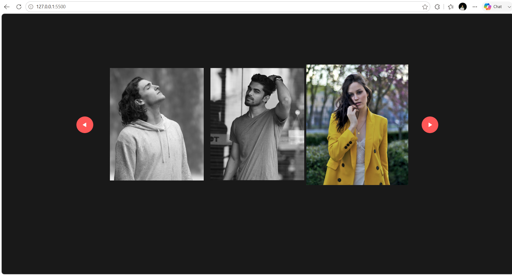

# 🖼️ Horizontal Scroll Image Gallery

A modern and responsive **Horizontal Scroll Image Gallery** built using **HTML, CSS, and JavaScript**. This project allows users to browse images horizontally using navigation buttons or the mouse wheel, providing a smooth and interactive gallery experience.

---

## 🚀 Live Demo

🌐 **Live Website:** https://30-day-30-projects-tius.vercel.app/

---

## 📸 Project Preview



---

## ✨ Features

- 🖼️ Horizontal Image Gallery
- ⬅️➡️ Previous & Next Navigation Buttons
- 🖱️ Mouse Wheel Horizontal Scrolling
- ✨ Smooth Scroll Animation
- 📱 Responsive Design
- 🎨 Clean & Modern UI
- ⚡ Lightweight & Fast

---

## 🛠️ Technologies Used

- HTML5
- CSS3
- JavaScript

---

## 📂 Folder Structure

```text
Horizontal-Scroll-Gallery/
│
├── index.html
├── style.css
├── README.md
│
├── images/
│   ├── back.png
│   ├── next.png
│   ├── image-1.png
│   ├── image-2.png
│   ├── image-3.png
│   ├── image-4.png
│   ├── image-5.png
│   ├── image-6.png
│   └── preview.png
```

---

## 🚀 Getting Started

### Clone the Repository

```bash
git clone https://github.com/ydv-hrx/30-Day-30-Projects.git
```

### Navigate to the Project

```bash
cd Horizontal-Scroll-Gallery
```

### Run the Project

Open **index.html**

or

Use **Live Server** in VS Code.

---

## 📖 Project Highlights

- Interactive horizontal image gallery
- Smooth scrolling using JavaScript
- Mouse wheel support for horizontal navigation
- Previous and Next button controls
- Responsive layout for different screen sizes
- Beginner-friendly project structure

---

## 🎯 Learning Outcomes

While building this project, I learned:

- JavaScript DOM Manipulation
- Horizontal Scrolling
- Mouse Wheel Events
- Event Listeners
- Smooth Scroll Behavior
- Responsive Web Design

---

## 💡 Future Improvements

- 🔍 Lightbox Image Preview
- ❤️ Favorite Images
- 🖼️ Dynamic Image Loading
- 📱 Touch Swipe Support
- ♾️ Infinite Scrolling
- ⌨️ Keyboard Navigation
- 🌙 Dark Mode
- 🎬 Auto Scroll Feature

---

## 👨‍💻 Author

**Hrithik Roshan**

📧 Email: hrithikroshan1811@gmail.com

🐙 GitHub: https://github.com/ydv-hrx

💼 LinkedIn: https://www.linkedin.com/in/hrithik-roshan-a55772333

---

## ⭐ Show Your Support

If you found this project helpful, please consider giving this repository a **⭐ Star**.

---

## 📅 30 Days Project Challenge

This project is part of my **#30DaysProjectChallenge**, where I'm building one project every day to improve my frontend development skills and create a strong developer portfolio.

Stay tuned for more exciting projects! 🚀

---

## 📬 Connect With Me

💼 **LinkedIn:** https://www.linkedin.com/in/hrithik-roshan-a55772333

🐙 **GitHub:** https://github.com/ydv-hrx