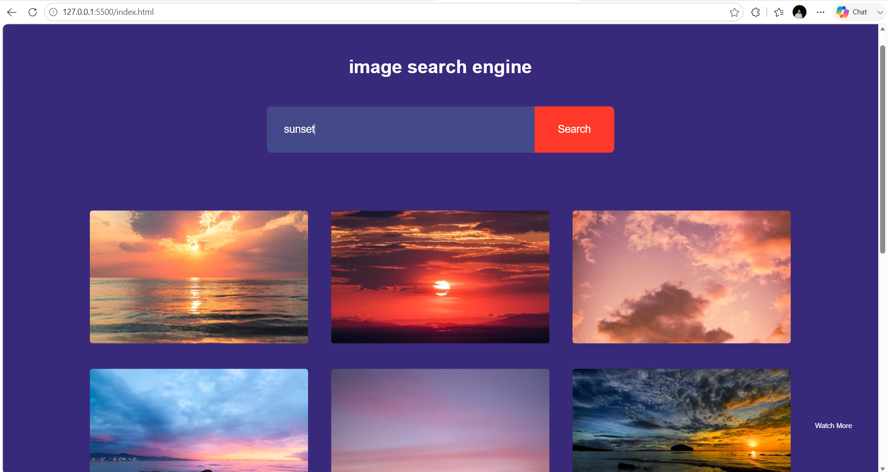

# 🔍 Image Search Engine

A modern and responsive **Image Search Engine** built using **HTML, CSS, and JavaScript**. This project uses the **Unsplash API** to search and display high-quality images based on user queries. It also includes a **"Show More"** feature to load additional images dynamically.

---

## 🚀 Live Demo

🌐 **Live Website:** *(Add your Vercel link here)*

---

## 📸 Project Preview



---

## ✨ Features

- 🔍 Search Images by Keyword
- 🖼️ High-Quality Images from Unsplash
- 📄 Show More Images
- ⚡ Fast API Integration
- 📱 Responsive Design
- 🎨 Clean & Modern User Interface
- 🔗 Open Images on Unsplash

---

## 🛠️ Technologies Used

- HTML5
- CSS3
- JavaScript
- Unsplash API
- Fetch API

---

## 📂 Folder Structure

```text
Image-Search-Engine/
│
├── index.html
├── style.css
├── script.js
├── README.md
└── preview.png
```

---

## 🚀 Getting Started

### Clone the Repository

```bash
git clone https://github.com/ydv-hrx/30-Day-30-Projects.git
```

### Navigate to the Project

```bash
cd Image-Search-Engine
```

### Run the Project

Open **index.html**

or

Use **Live Server** in VS Code.

---

## 🔑 API Setup

This project uses the **Unsplash API**.

1. Create a free developer account on **Unsplash Developers**.
2. Create a new application.
3. Copy your **Access Key**.
4. Replace the placeholder in `script.js`:

```javascript
const accessKey = "YOUR_UNSPLASH_ACCESS_KEY";
```

> **Note:** Do not commit your personal API key to a public GitHub repository. Consider using environment variables or a backend proxy for production applications.

---

## 📖 Project Highlights

- Search images in real time
- Fetch data from the Unsplash API
- Dynamic image rendering using JavaScript
- "Show More" pagination feature
- Responsive and user-friendly interface
- Beginner-friendly API integration project

---

## 🎯 Learning Outcomes

While building this project, I learned:

- JavaScript Fetch API
- REST API Integration
- Async/Await
- JSON Data Handling
- DOM Manipulation
- Dynamic Content Rendering
- Responsive Web Design

---

## 💡 Future Improvements

- ❤️ Favorite Images
- 📥 Download Images
- 🌙 Dark Mode
- 🏷️ Category Filters
- 🔎 Search Suggestions
- ♾️ Infinite Scrolling
- 🖼️ Masonry Grid Layout
- 📜 Search History

---

## 👨‍💻 Author

**Hrithik Roshan**

📧 Email: hrithikroshan1811@gmail.com

🐙 GitHub: https://github.com/ydv-hrx

💼 LinkedIn: https://www.linkedin.com/in/hrithik-roshan-a55772333

---

## ⭐ Show Your Support

If you found this project helpful, please consider giving this repository a **⭐ Star**.

---

## 📅 30 Days Project Challenge

This project is part of my **#30DaysProjectChallenge**, where I'm building one project every day to improve my frontend development skills and create a strong developer portfolio.

Stay tuned for more exciting projects! 🚀

---

## 📬 Connect With Me

💼 **LinkedIn:** https://www.linkedin.com/in/hrithik-roshan-a55772333

🐙 **GitHub:** https://github.com/ydv-hrx