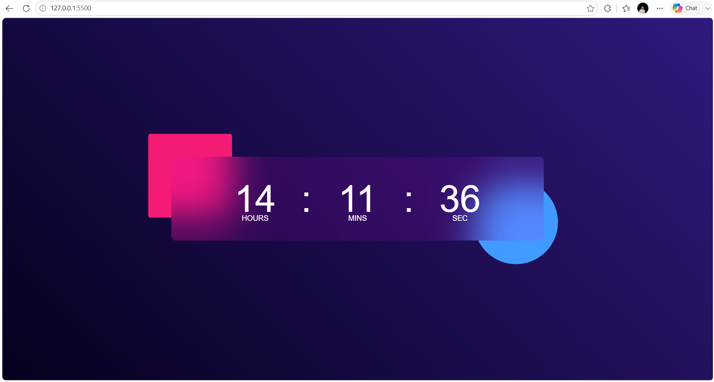

# 🕒 Digital Clock Web App

A modern and responsive **Digital Clock Web App** built using **HTML, CSS, and JavaScript**. This project displays the current time in **HH:MM:SS** format and updates every second using JavaScript's `Date` object and `setInterval()` function.

---

## 🚀 Live Demo

🌐 **Live Website:** https://30-day-30-projects-f1oj.vercel.app/

---

## 📸 Project Preview



---

## ✨ Features

- 🕒 Real-Time Digital Clock
- ⏱️ Live Time Updates Every Second
- 📱 Responsive Design
- 🎨 Modern Glassmorphism UI
- ⚡ Fast & Lightweight
- 💻 Beginner-Friendly JavaScript Project

---

## 🛠️ Technologies Used

- HTML5
- CSS3
- JavaScript

---

## 📂 Folder Structure

```text
Digital-Clock/
│
├── index.html
├── style.css
├── README.md
└── preview.png
```

---

## 🚀 Getting Started

### Clone the Repository

```bash
git clone https://github.com/ydv-hrx/30-Day-30-Projects.git
```

### Navigate to the Project

```bash
cd Digital-Clock
```

### Run the Project

Open **index.html**

or

Use **Live Server** in VS Code.

---

## 📖 Project Highlights

- Displays the current system time
- Updates automatically every second
- Uses JavaScript `Date` object
- Uses `setInterval()` for live updates
- Responsive and clean UI
- Simple and beginner-friendly code

---

## 🎯 Learning Outcomes

While building this project, I learned:

- JavaScript Date Object
- DOM Manipulation
- `setInterval()` Function
- Time Formatting
- Responsive Web Design
- CSS Styling

---

## 💡 Future Improvements

- 🌙 Dark & Light Mode
- 📅 Display Current Date
- 🌍 Multiple Time Zones
- ⏰ Alarm Feature
- ⏱️ Stopwatch
- ⌛ Countdown Timer
- 🎵 Alarm Sound
- 🌐 12-Hour / 24-Hour Format Toggle

---

## 👨‍💻 Author

**Hrithik Roshan**

📧 Email: hrithikroshan1811@gmail.com

🐙 GitHub: https://github.com/ydv-hrx

💼 LinkedIn: https://www.linkedin.com/in/hrithik-roshan-a55772333

---

## ⭐ Show Your Support

If you found this project helpful, please consider giving this repository a **⭐ Star**.

---

## 📅 30 Days Project Challenge

This project is part of my **#30DaysProjectChallenge**, where I'm building one project every day to strengthen my frontend development skills and create a professional portfolio.

Stay tuned for more exciting projects! 🚀

---

## 📬 Connect With Me

💼 **LinkedIn:** https://www.linkedin.com/in/hrithik-roshan-a55772333

🐙 **GitHub:** https://github.com/ydv-hrx