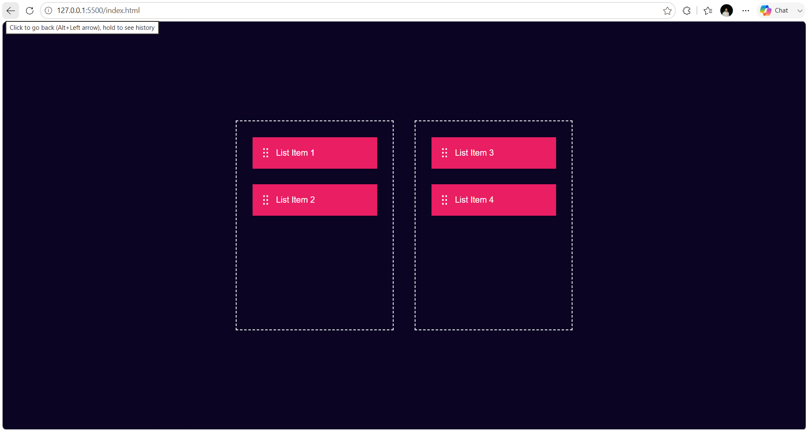

# 🎯 Drag & Drop Web App

A simple and interactive **Drag & Drop Web App** built using **HTML, CSS, and JavaScript**. This project demonstrates the HTML5 Drag and Drop API, allowing users to move items between two containers with an intuitive drag-and-drop interface.

---

## 🚀 Live Demo

🌐 **Live Website:** *(Add your Vercel link here)*

---

## 📸 Project Preview



---

## ✨ Features

- 🎯 Drag & Drop Functionality
- 📦 Move Items Between Containers
- ⚡ Real-Time Interaction
- 📱 Responsive Design
- 💻 Clean & Simple User Interface
- 🚀 Beginner-Friendly JavaScript Project

---

## 🛠️ Technologies Used

- HTML5
- CSS3
- JavaScript
- HTML5 Drag & Drop API

---

## 📂 Folder Structure

```text
Drag-Drop-Web-App/
│
├── index.html
├── style.css
├── icon.png
├── README.md
└── preview.png
```

---

## 🚀 Getting Started

### Clone the Repository

```bash
git clone https://github.com/ydv-hrx/30-Day-30-Projects.git
```

### Navigate to the Project

```bash
cd Drag-Drop-Web-App
```

### Run the Project

Open **index.html**

or

Use **Live Server** in VS Code.

---

## 📖 Project Highlights

- Interactive drag-and-drop interface
- Move list items between two containers
- Built using the HTML5 Drag & Drop API
- Lightweight and responsive design
- Beginner-friendly project structure

---

## 🎯 Learning Outcomes

While building this project, I learned:

- HTML5 Drag & Drop API
- JavaScript Event Handling
- DOM Manipulation
- Drag Events (`dragstart`, `dragover`, `drop`)
- Dynamic Element Movement
- Responsive UI Design

---

## 💡 Future Improvements

- 📋 Multiple Drag Zones
- ➕ Add New Items Dynamically
- 🗑️ Delete Items
- 💾 Save Item Positions with Local Storage
- ✨ Smooth Drag Animations
- 🎨 Better UI & Hover Effects
- 📱 Improved Mobile Touch Support

---

## 👨‍💻 Author

**Hrithik Roshan**

📧 Email: hrithikroshan1811@gmail.com

🐙 GitHub: https://github.com/ydv-hrx

💼 LinkedIn: https://www.linkedin.com/in/hrithik-roshan-a55772333

---

## ⭐ Show Your Support

If you found this project helpful, please consider giving this repository a **⭐ Star**.

---

## 📅 30 Days Project Challenge

This project is part of my **#30DaysProjectChallenge**, where I'm building one project every day to improve my frontend development skills and create a strong developer portfolio.

Stay tuned for more exciting projects! 🚀

---

## 📬 Connect With Me

💼 **LinkedIn:** https://www.linkedin.com/in/hrithik-roshan-a55772333

🐙 **GitHub:** https://github.com/ydv-hrx